# Design em projetos de AI

Como a gente cuida de interface quando quem escreve o código é um agente.

**Tipo:** Padrão da Supernova Labs  
**Data:** 07/09/2026  
**Escopo:** Projeto novo e projeto herdado  

## Índice

1. [Contexto](#1-contexto)
2. [Objetivo](#2-objetivo)
3. [Solução](#3-solução)
   1. [Tokens](#31-camada-1-tokens)
   2. [Componentes](#32-camada-2-componentes)
   3. [Padrões de página](#33-camada-3-padrões-de-página)
   4. [Contexto](#34-camada-4-contexto)
   5. [Verificação](#35-camada-5-verificação)
4. [Casos de uso](#4-casos-de-uso)
5. [Implantação em projeto existente](#5-implantação-em-projeto-existente)
6. [Antipadrões](#6-antipadrões)
7. [DESIGN.md: a alternativa que seguimos estudando](#7-designmd-a-alternativa-que-seguimos-estudando)
8. [Referências](#8-referências)

---

## 1. Contexto

Você pede uma tela nova. O agente entrega em três minutos. E está errada — não de bug, mas de *não é assim que a gente faz*:

| O que saiu | O que devia ter saído |
| --- | --- |
| Um azul parecido | O azul do produto |
| Uma tabela escrita do zero | A `DataTable` que já existe |
| Só o caminho feliz | Carregando, vazio, erro |
| Deletar sem perguntar | Deletar pede confirmação, sempre |

Você corrige. Amanhã, outra tela, os mesmos erros.

**Não é um agente ruim. É um agente sem acesso.** Quando o time era só de gente, esse entendimento morava na cabeça de quem tinha um ano de casa. O agente começa do zero em toda sessão — e o que ele não sabe, ele inventa.

## 2. Objetivo

Responder a uma pergunta: **de onde vem o entendimento de design, e como ele chega até o agente?**

O padrão define o que precisa existir no repositório para que um agente produza interface consistente com o produto — sem uma pessoa revisando o mesmo erro toda semana — e como implantar isso num projeto que já existe.

---

## 3. Solução

Pensa num dev que entrou hoje. Para fazer a primeira tela sem perguntar nada, ele precisa saber quais são as cores e os espaçamentos do produto, que peças já existem, como é uma tela daqui, onde encontrar tudo isso, e como conferir se acertou antes de mostrar para alguém.

O agente precisa exatamente do mesmo. A diferença é que **o dev pergunta quando não sabe, e o agente inventa.**

Estas são as informações que o agente precisa ter, na ordem em que uma depende da outra:

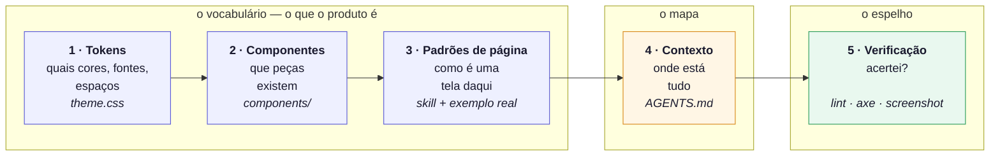

Chamamos cada uma de **camada** porque uma apoia a outra: sem cores definidas não há componentes consistentes; sem componentes não há padrão de tela; e nada disso vale se o agente não souber onde está, ou não conseguir se corrigir. A quinta é a que quase todo time esquece.

Nada disso é sobre gosto. É sobre o agente **enxergar decisões que já foram tomadas.**

**As cinco camadas são princípios, não uma stack.** Os arquivos citados daqui em diante são a resposta para React + Tailwind + shadcn, que é o que a gente usa. A pergunta de cada camada não muda; o que muda é o arquivo que a responde:

| Camada | A pergunta | React + Tailwind | Outra stack |
| --- | --- | --- | --- |
| 1 | Quais cores, fontes e espaços? | `theme.css` com `@theme` | Variáveis CSS em `:root` · tema do MUI · tokens do Stencil |
| 2 | Que peças já existem? | `components/ui/` + shadcn | Qualquer catálogo de componentes do projeto |
| 3 | Como é uma tela daqui? | Skill + symlink para a tela real | O mesmo, apontando para o exemplo da sua stack |
| 4 | Onde está cada coisa? | `AGENTS.md` | `AGENTS.md` — é convenção de agente, não de framework |
| 5 | Acertei? | Biome + Vitest + axe + screenshot | O linter, o test runner e o motor de acessibilidade que você já usa |

O que se instala é o princípio; a tecnologia é o veículo. Se ao ler este documento você trocar cada arquivo pelo equivalente da sua stack e o texto continuar fazendo sentido, é porque está funcionando como deveria.

---

### 3.1 Camada 1: Tokens

**A dor:** o agente escolhe um cinza. Amanhã escolhe outro. Em seis meses o produto tem 40 tons de cinza e ninguém decidiu nenhum deles.

**A regra:** token é um nome para um valor, em três níveis — e o agente **só usa o do meio**.

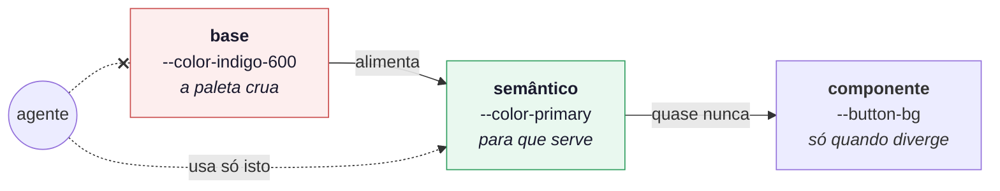

O nível semântico carrega a decisão: `--color-danger` diz *para que serve*; `--color-red-600` diz só qual cor é. Quando a marca mudar, o vermelho muda e o significado fica.

**O tema escuro é a prova de que a camada funciona.** Ele redefine só o nível semântico. Nenhum componente muda uma linha — o botão de tema nem conhece uma cor, só escreve `data-theme` no `<html>`:

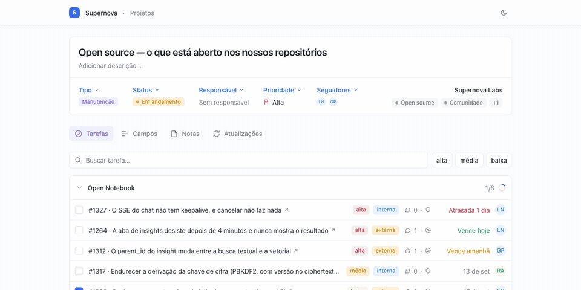

Se algum componente precisa de `dark:` numa classe, uma decisão de cor vazou para dentro dele.

<details>
<summary><b>Na prática</b> — o <code>theme.css</code> do projeto de referência, resumido</summary>

```css
/* src/styles/theme.css */
@import "tailwindcss";

@theme {
  /* base — a paleta crua. Ninguém usa direto. */
  --color-neutral-25:  oklch(0.99 0.002 260);
  --color-neutral-800: oklch(0.26 0.012 260);
  --color-indigo-600:  oklch(0.55 0.21 264);
  --color-rose-600:    oklch(0.58 0.21 18);

  /* semântico — o que o agente usa. Tema claro. */
  --color-bg:      var(--color-neutral-25);
  --color-fg:      var(--color-neutral-800);
  --color-primary: var(--color-indigo-600);
  --color-danger:  var(--color-rose-600);

  --text-body:      0.9375rem;   /* o único tamanho de corpo */
  --spacing-gutter: 1.5rem;      /* o espaço entre blocos de página */
}

/* tema escuro: redefine só o nível semântico */
@media (prefers-color-scheme: dark) {
  :root:not([data-theme="light"]) {
    --color-bg: var(--color-neutral-950);
    --color-fg: var(--color-neutral-100);
    /* … */
  }
}
:root[data-theme="dark"] { /* mesmo bloco — o botão de tema vence o sistema */ }
```

No componente, só o nível semântico: `bg-surface`, `text-fg`, `bg-primary`. Nunca o nível base (`bg-neutral-50`), nunca um valor cru (`bg-[#fafafa]`).

Falta uma cor? Não se usa a paleta base direto no componente. Cria-se um token semântico com nome de função, apontando para a base: `--color-warning: var(--color-amber-600)`. O componente usa `text-warning`; o amber continua existindo, mas só no nível base.

Tailwind v4 com `@theme` é o alvo porque a config vira CSS, e o agente lê CSS variable com confiança. Se o cliente já tem os valores em outra ferramenta, eles saem de lá uma vez, por script — nunca copiados à mão. [Rodamos essa conversão](../experiment/style-dictionary/): os nomes já saem no formato do Tailwind e as referências entre níveis sobrevivem.

</details>

> **Teste da camada:** troque o tema. Se algum componente precisou de `dark:`, a camada não está pronta.

---

### 3.2 Camada 2: Componentes

**A dor:** já existe um `Dropdown` no projeto. O agente escreve outro, com nome diferente, porque não sabia que existia.

Isso acontece mesmo com componente bem escrito, em Tailwind puro. O agente não varre o repositório inteiro antes de cada tela: ele escreve o que o pedido sugere. Se nada o obriga a olhar, ele não olha.

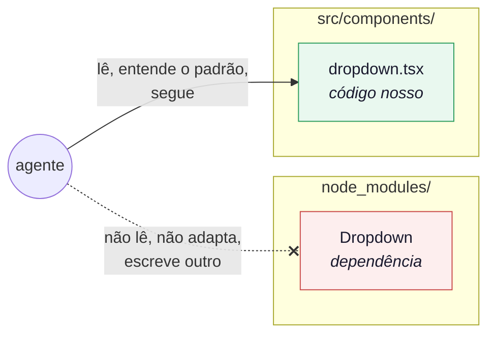

**A regra:** os componentes ficam no repositório, cada um diz para que serve, e o agente consulta antes de criar.

1. **No repositório, na convenção do mercado.** Um arquivo por componente, todos no mesmo formato, em `src/components/`. Se o componente está em `node_modules`, o agente não lê. Se está espalhado, ele não acha.

   A convenção que o shadcn e os templates da Vercel consolidaram, e que o agente já conhece de treinamento:

   ```
   src/components/
     ui/                ← peças genéricas, sem saber do produto: button, badge, states
     task-list.tsx      ← peças do produto, compostas com as de ui/
     record-header.tsx
   ```

   Projeto que já existe com outros nomes de pasta não precisa mudar nada: basta o `AGENTS.md` dizer onde está o quê.

2. **Cada componente diz para que serve**, num comentário em cima. É o que o agente lê quando abre a pasta — e é o que chega até ele pelo MCP, sem abrir nada:

   ```tsx
   /** Vazio. Sempre com a ação primária — tela vazia sem saída é beco. */
   export function EmptyState({ title, action }: …) { … }

   /** Erro. Nunca uma tela em branco: diz o que houve e oferece tentar de novo. */
   export function ErrorState({ onRetry }: …) { … }
   ```

3. **A instrução de consultar antes de criar**, no `AGENTS.md`. Sem ela, os dois itens acima são uma pasta que ninguém abre. No projeto de referência ela tem duas formas: *"leia a pasta antes"* e, com o Storybook rodando, *"pergunte ao MCP o que existe"* — o `docs-list` devolve a lista com o comentário de cada um.

O resultado é o agente compondo com o que existe, e criando só o que falta, no formato dos vizinhos.

#### Sugestão: shadcn para o que tem comportamento

Para componentes mais complexos, como dialog, dropdown, combobox, popover e date picker, escrever do zero significa resolver foco, teclado, posicionamento e `aria-*` — umas duzentas linhas cada, e exatamente o que o agente mais erra ao inventar.

A sugestão para esses é o [shadcn/ui](https://ui.shadcn.com): um comando copia o componente para `src/components/ui/`, e ele passa a ser seu — mesma pasta, mesmo formato, mesma regra. Em 2026 ele virou o formato de distribuição de UI para agente, com MCP oficial, skills, presets e registry privado.

Se o projeto já usa outra biblioteca — Mantine, MUI, o que for — não se troca. Documenta as decisões em cima dela na camada 4.

**Quando rodar o `init` depende do projeto.** Ele traz o próprio vocabulário de tokens, e os componentes copiados dependem desses nomes:

| Projeto | O que fazer |
| --- | --- |
| Do zero | `init` primeiro. O `theme.css` nasce com os nomes do shadcn. |
| Existente, sem sistema | `init`, apagar o bloco de tokens injetado, e apelidar os nomes que os componentes usam para os seus tokens. Uma vez só. |
| Existente, com sistema próprio | Não roda o `init`. Documenta o que existe. |

Rodamos os dois primeiros casos: o relato está em [`experiment/shadcn-cli/`](../experiment/shadcn-cli/).

<details>
<summary><b>Na prática</b> — do zero até o agente instalar componente sozinho</summary>

```bash
bunx shadcn@latest init                       # preset: cores, fonte, ícones, raio
bunx shadcn@latest add button input dialog table form
bunx shadcn@latest mcp init --client claude   # o agente passa a consultar o catálogo
bunx skills add shadcn/ui                     # e a saber usar o CLI
```

Depois disso, *"adiciona um seletor de data"* vira o agente consultando o catálogo, achando `calendar` + `popover` e compondo — em vez de escrever um do zero.

Componentes que o cliente reusa entre produtos viram um **registry privado**, e a identidade viaja:

```jsonc
// components.json
{
  "registries": {
    "@acme": {
      "url": "https://registry.acme.com/{name}.json",
      "headers": { "Authorization": "Bearer ${REGISTRY_TOKEN}" }
    }
  }
}
```

</details>

> **Teste da camada:** peça algo que já existe com outro nome — *"um menu de ações"*. Se o agente usou o `Dropdown` em vez de escrever um, a camada está funcionando. Com o shadcn, peça *"um seletor de data"* e veja se ele consulta o catálogo. [Rodamos](../experiment/shadcn-cli/): ele compôs `calendar` + `popover` + `button`.

---

### 3.3 Camada 3: Padrões de página

Esta é a camada que quase ninguém tem — e a que mais muda o resultado.

**A dor:** o agente já sabe fazer um botão. O que ele inventa é a *tela*. Nem o shadcn, nem o Storybook, nem o Figma respondem "como é uma tela de lista *neste* produto". É uma decisão do produto, e mora com ele.

**A regra:** uma skill por padrão, com um exemplo real junto. A skill descreve a anatomia; o exemplo mostra.

Esta é a anatomia da tela de referência do projeto, e a skill diz exatamente isso, nesta ordem:

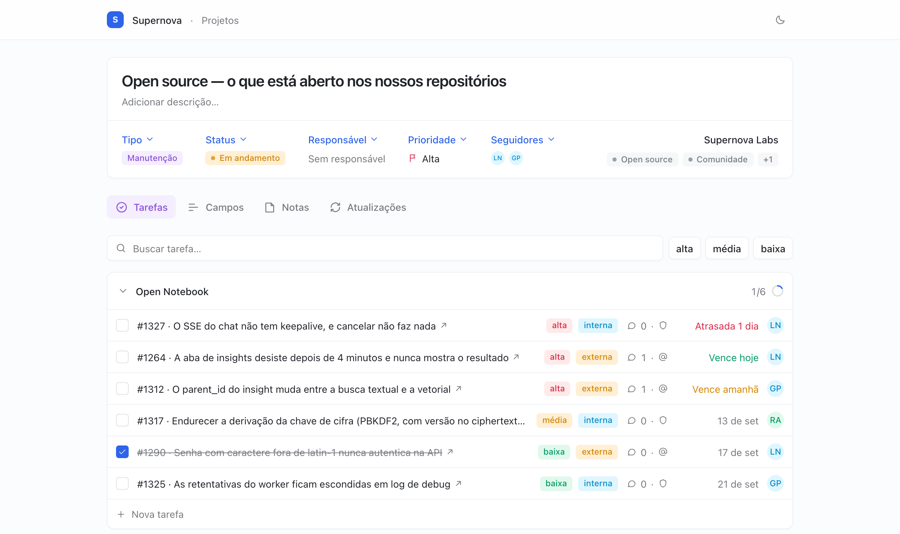

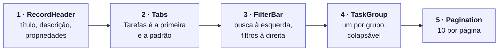

**Toda tela tem quatro estados, sempre.** Não é detalhe: é a diferença entre uma tela e uma demo.

| Carregando — skeleton, nunca spinner | Erro — nunca tela em branco |
| --- | --- |
| 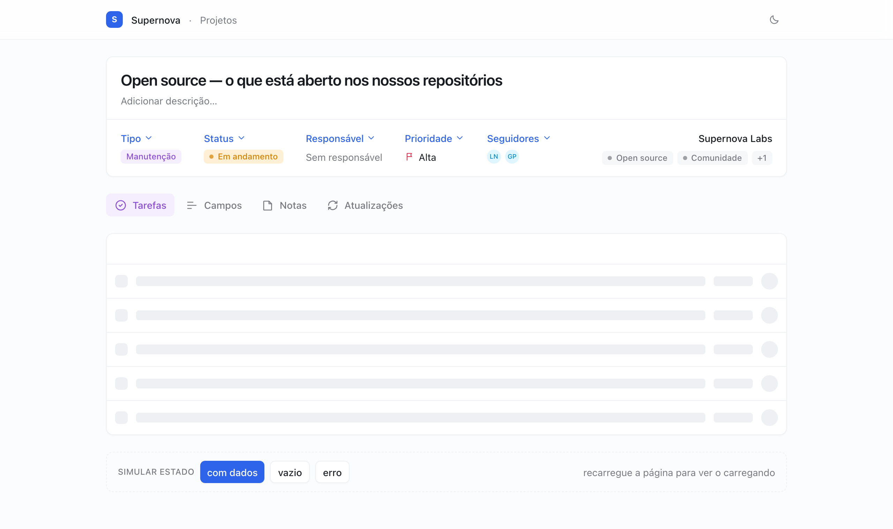 | 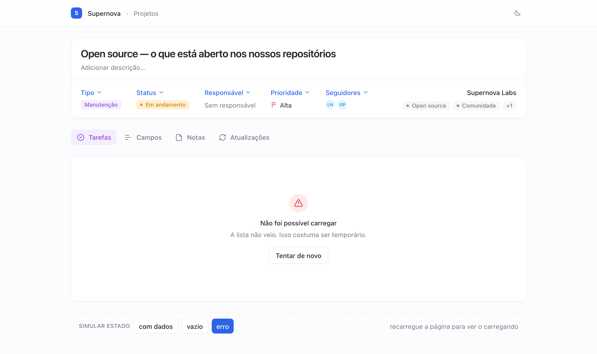 |
| **Vazio — com a ação primária** | **Vazio por filtro — com "limpar filtros"** |
| 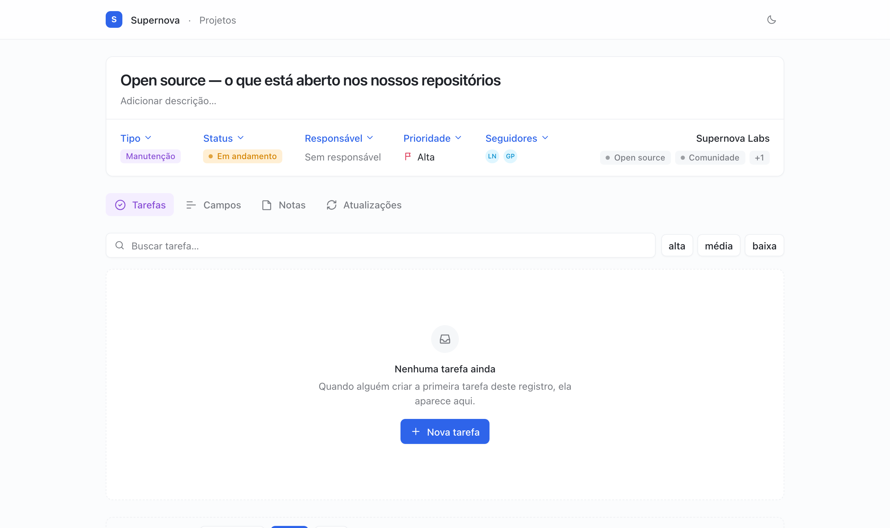 | 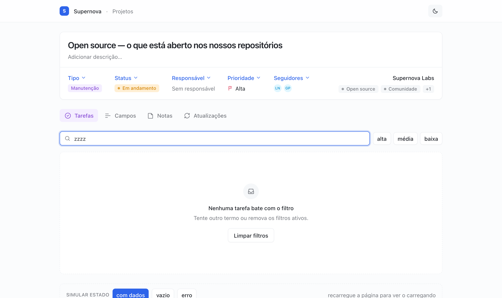 |

E a tela sabe o que some quando aperta — nesta ordem: prazo, contador, badges. Checkbox, título e avatar nunca somem.

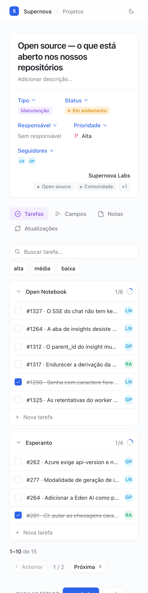

**O detalhe que evita o drift:** o exemplo da skill não é uma cópia da tela — é um **symlink** para o arquivo que está em produção. Cópia envelhece em silêncio; symlink não tem como.

```
.claude/skills/page-tasks/
  SKILL.md
  example.tsx  →  ../../../src/pages/TasksPage.tsx
```

Na prática, poucos padrões cobrem quase tudo: lista com filtro · form de criar e editar · detalhe de registro · settings · estado vazio · estado de erro · confirmação destrutiva.

<details>
<summary><b>Na prática</b> — a skill <code>page-tasks</code> do projeto de referência, inteira</summary>

```markdown
---
name: page-tasks
description: Detalhe de um registro com lista de tarefas agrupadas. Use quando a tela mostra um registro (projeto, conta, caso) e as tarefas ligadas a ele.
---

# Detalhe de registro com tarefas

Toda tela deste tipo tem a mesma anatomia. Não invente outra.

## De cima para baixo

1. `<RecordHeader>` — título, descrição editável e as propriedades do registro.
2. `<Tabs>` — Tarefas é a primeira e a padrão. Aba ativa usa `accent`, nunca `primary`.
3. `<FilterBar>` — busca à esquerda, filtros de prioridade à direita.
4. `<TaskGroup>` — um por grupo, colapsável, com `<ProgressRing>` à direita.
5. `<Pagination>` — 10 tarefas por página, contando o total filtrado.

Entre os blocos, `space-y-gutter`. Dentro do painel de tarefas, `space-y-4`.

## A linha de tarefa

`<Checkbox>` · título · `<Badge>` de prioridade · `<Badge>` de escopo ·
contador de comentários · prazo · `<Avatar>` do responsável

**O que some em tela estreita**, nesta ordem: prazo (abaixo de `lg`), contador
(abaixo de `md`), badges (abaixo de `sm`). Checkbox, título e avatar nunca somem.

## Prazo: a cor carrega significado

| Situação | Token | Texto |
| --- | --- | --- |
| Atrasada | `text-danger` | "Atrasada N dias" |
| Vence hoje | `text-success` | "Vence hoje" |
| Vence amanhã | `text-warning` | "Vence amanhã" |
| Depois | `text-muted` | data curta |

A cor nunca vai sozinha — o texto diz a mesma coisa, para quem não distingue as cores.

## Os quatro estados, sempre

| Estado | Componente |
| --- | --- |
| Carregando | `<TasksSkeleton />` — nunca spinner |
| Vazio | `<EmptyState>` com a ação primária |
| Vazio por filtro | `<EmptyState>` com "Limpar filtros" |
| Erro | `<ErrorState onRetry />` — nunca tela em branco |

## Varia e não varia

**Varia:** os grupos, os filtros, as colunas de metadado da linha, os textos.
**Não varia:** a ordem dos blocos, os componentes, os quatro estados, a ordem
da linha de tarefa, o gutter, 10 por página.

## Referência

`example.tsx` é a tela real deste projeto — não uma cópia. Copie a estrutura dela.

## Antes de dizer pronto

- [ ] Usa `RecordHeader`, `Tabs`, `FilterBar`, `TaskGroup`, `Pagination` — não versões próprias
- [ ] Os quatro estados existem
- [ ] `bun lint` e `bun run test:ui` passam
- [ ] **Screenshot em 1280px (desktop) e 375px (celular), comparado com o exemplo.** Um título longo trunca?
      Nenhum elemento sobrepõe outro?
- [ ] Troque o tema: nada perde contraste
```

</details>

> **Teste da camada:** peça uma tela irmã da de referência. Se o agente carregou a skill e copiou a estrutura em vez de inventar, a camada está funcionando.

---

### 3.4 Camada 4: Contexto

**A dor:** as três camadas anteriores existem, mas o agente não sabe que existem.

**A regra:** o `AGENTS.md` tem uma função só — **dizer onde está cada coisa e o que não se faz.** Ele não repete token nem padrão de tela. Ele aponta.

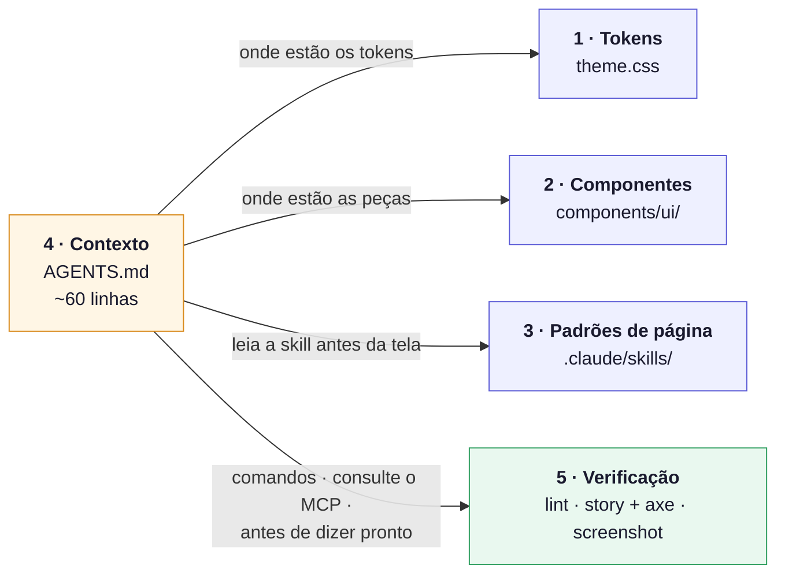

E precisa ser **curto**. Arquivo de 150 linhas o agente lê o começo e ignora o resto. O do projeto de referência tem 64 linhas — e são basicamente essas quatro setas.

<details>
<summary><b>Na prática</b> — o <code>AGENTS.md</code> do projeto de referência, inteiro</summary>

```markdown
# UI — como trabalhar neste repo

## Stack

React 19 · Vite · Tailwind v4 (tokens em `src/styles/theme.css`) · TypeScript.
Componentes em `src/components/`: as peças genéricas em `ui/`, as do produto ao lado. Padrão shadcn, código nosso, no repo.

## Onde está o quê

- **Tokens**: `src/styles/theme.css`. Componente usa **só o nível semântico**.
- **Componentes genéricos**: `src/components/ui/` — botão, badge, estados, sem saber do produto.
- **Componentes do produto**: `src/components/` — `RecordHeader`, `TaskGroup`, `UpdateList`. Consulte as duas pastas antes de criar qualquer coisa.
- **Padrões de página**: `.claude/skills/page-*/`. **Antes de criar uma tela, leia a skill do padrão.**
- **Tela de referência**: `src/pages/TasksPage.tsx` — é o exemplo real do padrão `page-tasks`.

## Comandos

- `bun dev` — sobe a aplicação
- `bun lint` — Biome: falha em cor crua, token do nível base, `div` clicável e formatação
- `bun run format` — aplica as correções automáticas do Biome
- `bun run build` — typecheck + build
- `bun storybook` — o catálogo de componentes, com o MCP em `localhost:6006/mcp`
- `bun run test:ui` — roda toda story num navegador de verdade, com axe

## Os cinco erros mais comuns aqui

1. Cor em hex ou classe `bg-gray-*` em vez do token semântico. O lint pega.
2. Criar componente que já existe em `components/` com outro nome — leia as duas pastas antes.
3. Tela sem os quatro estados (carregando, vazio, vazio-por-filtro, erro).
4. Spinner no lugar de skeleton. Toda lista tem seu esqueleto.
5. `div` com `onClick`. Botão é `<Button>`, link é `<a>`.

## Tema claro e escuro

Nenhum componente conhece o tema. Se você está escrevendo `dark:` numa classe, parou no
lugar errado: a diferença entre os temas mora só no `theme.css`, redefinindo o nível
semântico. Componente usa `bg-surface` e funciona nos dois.

## Consulte antes de criar

Com o Storybook rodando (`bun storybook`), o MCP responde o que existe:

- `docs-list` — todos os componentes, com a regra de uso de cada um
- `docs-show` — as props de um componente
- `test-run` — roda as stories e devolve as violações de acessibilidade

**Consulte antes de escrever um componente novo.** Quase sempre já existe.

## Antes de dizer "pronto"

1. `bun lint` passa. *(pega cor crua, classe errada, `div` clicável)*
2. `bun run build` passa.
3. `bun run test:ui` passa. *(pega componente que não renderiza ou que o axe reprova)*
4. Se é uma tela: os quatro estados existem e a anatomia bate com a skill.
5. **Tire um screenshot em 1280px (desktop) e em 375px (celular)** e compare com o exemplo da skill. Diga o que
   bateu e o que não bateu com a referência — não só o que viu. *(pega o que as três
   anteriores não pegam: título que atravessa a linha, elemento que sobrepõe outro,
   coluna que some errado)*
6. Troque o tema. Nada some, nada perde contraste.

Se algum falhar, não está pronto.

O passo 5 existe por um motivo concreto: o lint e o build passam num layout quebrado.
Ver `experiment/agents-md/`.
```

Repare no que **não** está aí: nenhum token, nenhum padrão de tela, nenhuma explicação de design. Só o mapa e as regras.

</details>

> **Teste da camada:** o [experimento](../experiment/agents-md/) — a mesma tela, com e sem o arquivo. Se as duas saem iguais, o `AGENTS.md` não está sendo lido. É a primeira coisa a corrigir, antes de qualquer outra camada.

---

### 3.5 Camada 5: Verificação

Sem esta camada, as outras quatro são documentação — e documentação que ninguém verifica mente em silêncio.

**A dor:** o agente diz "pronto". Quem descobre que não está é uma pessoa, na review, uma hora depois. A cada vez.

**A regra:** o agente olha o próprio trabalho antes de entregar. É o mesmo princípio dos testes.

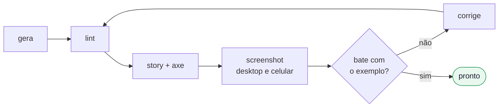

#### Por que são três peças, e não uma

É tentador parar no lint, que é a mais barata. Mas cada peça pega uma classe diferente de erro:

| Peça | Pega | Não pega |
| --- | --- | --- |
| **Lint** | vocabulário: cor crua, classe errada, `div` clicável | composição |
| **Story + axe** | o componente renderiza e é acessível | como ele se comporta na página |
| **Screenshot comparado** | layout: o que vaza, sobrepõe, some | intenção |

Há uma quarta, a regressão visual entre versões, que pega mudança não intencional — e não pega a primeira versão já errada. Entra só no estágio 3, porque em PR de agente o pixel-diff gera mais ruído do que sinal.

**axe** é o motor de acessibilidade da Deque, o mesmo por trás da aba Accessibility do Lighthouse. Ele examina a página renderizada e devolve as violações das regras WCAG: botão só com ícone sem `aria-label`, contraste insuficiente, campo sem rótulo, elemento clicável que o teclado não alcança. Aqui ele roda em toda story, e uma violação falha o teste.

A gente aprendeu isso apanhando. No experimento da camada 4, a versão sem contexto montou o link como elemento `inline` dentro de uma `div` — e `truncate` não tem efeito em `inline`. **O lint passou. O build passou.** Os elementos estavam certos; a composição, não.

| Sem contexto — o título atravessa a linha | Com contexto — trunca, o resto fica intacto |
| --- | --- |
| 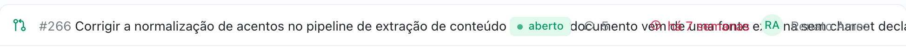 | 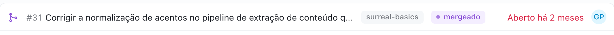 |

Só o screenshot pegaria. A análise completa está em [`experiment/agents-md/`](../experiment/agents-md/).

<details>
<summary><b>Na prática</b> — as três peças, no projeto de referência</summary>

**1. Regra vira lint, não instrução.** "Evite cores fora da paleta" num documento é sugestão. No lint é lei:

```jsonc
// biome.json — o lint e o formatador num binário só
{
  "plugins": [
    "./.biome/rules/no-hex-color.grit",
    "./.biome/rules/no-hex-literal.grit",
    "./.biome/rules/no-base-token.grit"
  ],
  "linter": { "rules": { "recommended": true,
    // div clicável: o Biome já traz as duas regras prontas
    "a11y": { "noStaticElementInteractions": "error", "useKeyWithClickEvents": "error" } } }
}
```

As regras de vocabulário do produto são plugins em GritQL, um arquivo por regra:

```
// .biome/rules/no-base-token.grit
language js

jsx_attribute(name=`className`, value=$v) where {
  $v <: r".*\b(?:bg|text|border)-(?:gray|blue|red|slate|zinc|neutral)-[0-9]{2,3}\b.*",
  register_diagnostic(span = $v, message = "Esse é o nível base da paleta. Use o token semântico.")
}
```

> **Dois detalhes que custaram tempo.** O regex do GritQL casa o valor inteiro, não um trecho: sem os `.*` nas pontas, a regra não dispara. E `or` no topo do arquivo descarta os ramos seguintes, então cada regra mora no próprio arquivo.

> **Escope a regra, ou ela vira ruído.** A primeira versão da regra de hex olhava qualquer literal — e acusou `#1327`, um número de issue num título, como se fosse cor. Regra com falso positivo é regra que o time desliga na semana seguinte. Hoje o escopo é a *forma*: a cor crua só é acusada quando o literal é só a cor, ou quando está num valor arbitrário do Tailwind.

**2. Acessibilidade vira teste vermelho.** Toda story roda num Chromium real, com o axe:

```tsx
// .storybook/preview.tsx
parameters: { a11y: { test: "error" } }   // violação falha o teste; não é aviso
```

```ts
// vitest.config.ts
plugins: [storybookTest({ configDir: ".storybook" })],
test: { browser: { enabled: true, headless: true, provider: playwright(), instances: [{ browser: "chromium" }] } }
```

**3. E olha o resultado.** O agente tira o próprio screenshot pelo Playwright MCP, em 1280px (desktop) e em 375px (celular), e compara com o exemplo da skill. A instrução está no `AGENTS.md`; o servidor, no `.mcp.json`:

```json
// .mcp.json
{ "mcpServers": {
  "playwright": { "command": "bunx", "args": ["@playwright/mcp@latest", "--headless"] },
  "storybook":  { "type": "http", "url": "http://localhost:6006/mcp" }
} }
```

O segundo servidor é o do Storybook: com ele o agente pergunta quais componentes existem e quais props aceitam, em vez de abrir a pasta. É consulta, não verificação — serve à camada 2.

</details>

O CI é a rede de segurança. O loop é o que evita cair nela.

> **Teste da camada:** plante `style={{ color: "#ff0000" }}` num componente e rode `bun lint`. Tire o `aria-label` de um botão só com ícone e rode `bun run test:ui`. Os dois têm que ficar vermelhos.
>
> E o loop inteiro: peça uma tela nova e veja se o agente tira o screenshot sem ser lembrado. [Rodamos](../experiment/screenshot-loop/): tirou, nos dois tamanhos e nos dois temas, e de novo depois de uma mudança.

---

## 4. Casos de uso

Duas situações que aparecem em quase todo projeto, e o que muda nelas com as camadas no lugar.

#### Uma tela nova, do pedido à produção

A pergunta que organiza esta seção não é qual ferramenta usar para propor a tela. É **onde a proposta nasce** — fora do repositório, ou a partir dele.

Quando a tela não bate com o desenho, é lido como falha do agente. Não é: são duas fontes sem contrato. O agente traduz o desenho na hora, e traduzir é interpretar. O contrato que resolve é um só: **o código é a fonte da verdade; a proposta é uma proposta.** Se for o contrário, o passo de implementar vira *"copie o desenho"* e as cinco camadas deixam de valer.

| # | Passo | Proposta em canvas externo | Proposta a partir do repositório |
| --- | --- | --- | --- |
| 1 | Alguém propõe a tela | Figma — um artefato que vive fora do código | Claude Design, Codex — a ferramenta lê o repositório e propõe já em código |
| 2 | O agente recebe o pedido | o desenho, pelo MCP da ferramenta | a demanda em texto |
| 3 | **Lê o repositório** — tokens, componentes e o padrão de tela | `AGENTS.md` | `AGENTS.md` — e já leu no passo 1 |
| 4 | Traduz a proposta para o vocabulário do produto | o código manda | — *já nasceu no vocabulário* |
| 5 | Implementa a tela | camadas 1 a 3 | camadas 1 a 3 |
| 6 | **Verifica antes de dizer "pronto"** — lint, story com axe, screenshot | camada 5 | camada 5 |
| 7 | Uma pessoa aprova | uma pessoa | uma pessoa |
| 8 | Reconcilia proposta e código | engano no desenho corrige o canvas; decisão nova entra no sistema | — *a proposta já é o código* |
| 9 | Produção | PR | PR |

O miolo é idêntico nas duas: ler o repositório, implementar, verificar, aprovar. É ali que o resultado se decide, e é ali que as cinco camadas agem.

**O canvas externo** compra um artefato para discutir antes de existir código — alinhar pessoas, explorar variações, decidir junto. Quem tem desenhista no time e um canvas vivo tem essa vantagem, e ela é real. O preço são os passos 4 e 8: manter duas representações em acordo. Com Code Connect, cada componente do canvas aponta para o arquivo real no repositório, e o agente recebe código em vez de imagem — é a diferença entre *"faça uma tabela parecida com esta imagem"* e *"use a `DataTable`"*. Fica caro só quando ninguém reconcilia: o canvas vira ficção e cada tela nova herda a divergência.

**A proposta a partir do repositório** não produz artefato paralelo: a ferramenta lê as camadas 1 a 3 e devolve código já no vocabulário do produto. Não há o que traduzir nem reconciliar. É o que a gente usa aqui na Supernova, onde não há ninguém de design — e não substitui a conversa que um canvas permite; troca o artefato de discussão por algo executável.

Se o seu Figma está abandonado, não se ressuscita: os tokens saem dele uma vez, ele vira histórico, e você passa para a coluna da direita conscientemente.

#### O protótipo que não serve para nada

Quem precisa mostrar a ideia antes de ela existir — produto, negócio, quem apresenta ao cliente — monta a tela com o agente. Aprovam. O dev vai construir e o protótipo não ajuda: componente que não existe, espaçamento inventado, estados que ninguém previu. O que foi aprovado não é o que é entregue.

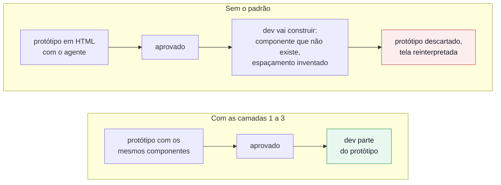

**O que o padrão muda:** o protótipo passa a ser feito com o mesmo vocabulário do produto.

| Camada | O que ela dá ao protótipo |
| --- | --- |
| [1 · Tokens](#31-camada-1-tokens) | as cores e espaçamentos certos, sem escolher nada |
| [2 · Componentes](#32-camada-2-componentes) | as mesmas peças que o dev vai usar |
| [3 · Padrões de página](#33-camada-3-padrões-de-página) | a anatomia da tela, com os estados que o protótipo esqueceria |

O protótipo deixa de ser uma referência a interpretar e vira o ponto de partida. E o que não existe no sistema aparece cedo, na validação da ideia, não no meio da construção.

Um limite honesto: protótipo não passa por lint nem CI, e nem deve. Ele herda o vocabulário, não o rigor.

---

## 5. Implantação em projeto existente

Num projeto novo, as cinco camadas entram desde o primeiro commit e não há o que implantar. Esta seção é para o outro caso: **o front que já existe**, com telas em produção, cores espalhadas e nenhum dos cinco artefatos no lugar.

Três estágios. Não se pula estágio.

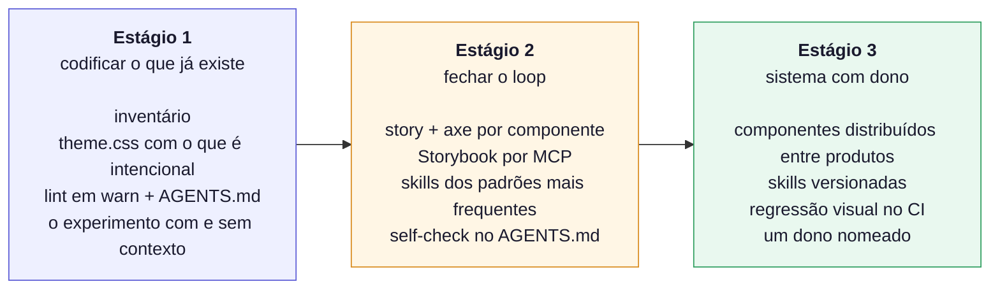

#### Estágio 1 — Codificar o que já existe

Não cria nada novo. Organiza o que está lá para o agente enxergar.

| Passo | O quê | O detalhe que importa |
| --- | --- | --- |
| 1 | **Inventário** | Contar a dívida antes de decidir. O normal é achar 30 a 60 cores onde deveriam existir 8. |
| 2 | **Tokens** | Só o que é *intencional*: as 8 cores que aparecem 200 vezes. As 40 que aparecem uma vez são erro, não decisão. Não migrar nada ainda. |
| 3 | **Lint e mapa** | Lint em `warn`, não `error` — ele vai apontar centenas de lugares, e isso é backlog, não bloqueio. `AGENTS.md` com os cinco erros tirados do inventário real. |
| 4 | **O teste** | A mesma tela, sem e com o `AGENTS.md`. Se as duas saem iguais, o arquivo não está sendo lido — corrija isso antes de qualquer outra coisa. |

<details>
<summary>Os comandos do inventário</summary>

```bash
# quantas cores existem hoje?
grep -rhoE '#[0-9a-fA-F]{3,8}\b' src | sort | uniq -c | sort -rn | head -30
grep -rhoE '\b(bg|text|border)-[a-z]+-[0-9]{2,3}\b' src | sort | uniq -c | sort -rn | head -30
# quantos tamanhos de fonte?
grep -rhoE '\btext-(xs|sm|base|lg|xl|[0-9]xl|\[[^]]+\])' src | sort | uniq -c | sort -rn
```

</details>

O passo 4 é o [experimento da camada 4](../experiment/agents-md/), rodado em 09/09/2026: as duas versões passaram no lint e no build, e o que separou foi estrutura, não vocabulário.

**O que não se faz aqui:** migrar telas antigas, criar componente novo, instalar Storybook, escrever skill. Isso é estágio 2.

#### Estágio 2 — Fechar o loop

O agente passa a verificar o próprio trabalho. A review humana deixa de ser *"isso está fora do padrão?"* e vira *"isso resolve o problema?"*.

#### Estágio 3 — Sistema com dono

Só faz sentido com mais de um produto compartilhando identidade, ou horizonte longo. E **um dono nomeado**: design system sem dono morre em meses.

#### Quando existe mais de um front

Tudo acima assume **um repositório de front**. Backoffice, portal do cliente, app interno — cada um com seu `theme.css` e seu catálogo — e a camada 1 se multiplica em vez de resolver: três arquivos de token, três definições de primária, três jeitos de fazer um botão.

Duas perguntas decidem o caminho:

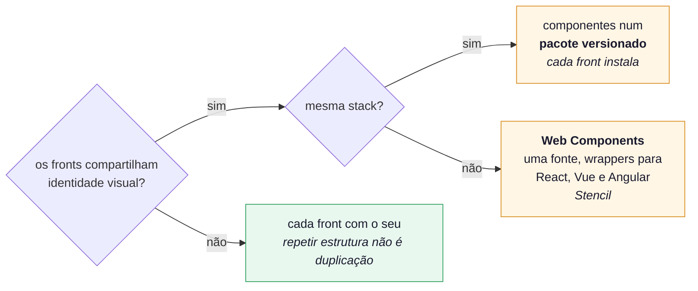

**O que muda com um pacote.** Os componentes deixam de ser lidos como código-fonte e passam a ser importados: o agente lê os tipos do pacote em vez de vasculhar arquivos, atualizar vira subir versão em vez de copiar arquivo, e quem não tem acesso ao repositório ainda consegue consumir. As camadas 1 e 2 mudam de endereço; as camadas 3, 4 e 5 continuam em cada repositório, porque padrão de tela e verificação são de *cada produto*.

**O que isso custa.** Versionamento, changelog, política de quebra e alguém publicando. É o estágio 3 com outro nome — não comece por aqui.

> Um exemplo dessa forma, com quatro marcas saindo de uma fonte só: Web Components em [Stencil](https://stenciljs.com/), tokens gerados por pipeline e um pacote por produto. Vale como referência de arquitetura, não de ponto de partida.

---

## 6. Antipadrões

| Não faz | Por quê | Faz |
| --- | --- | --- |
| Colar o design system no prompt | 30k tokens por consulta, 82% de cobertura e alucinações (benchmark da Indeed, 1.056 prompts) | Expõe por MCP |
| `AGENTS.md` de 150 linhas | O agente lê o começo e ignora o resto | 60 linhas apontando |
| Documentar componente à mão | Drifta em silêncio até o agente gerar errado | JSDoc no código, exposto pelo MCP |
| Regra escrita em texto ("evite cores fora da paleta") | Texto é sugestão; o agente lê e segue em frente | Regra em lint, que falha o build |
| Componente sem padrão de tela | O agente monta a página do zero toda vez | Skill por padrão, com exemplo real |
| Exemplo copiado para a skill | Envelhece em silêncio | Symlink para a tela real |
| Design system sem dono | Morre em meses | Um dono nomeado, com mandato para podar e consolidar |
| Pixel-diff em todo PR | Ruído demais, o time para de olhar | Só no estágio 3 |

---

## 7. DESIGN.md: a alternativa que seguimos estudando

O Google Labs publicou o [`DESIGN.md`](https://github.com/google-labs-code/design.md), um formato aberto para descrever um design system em **um arquivo só**, que qualquer agente lê. É cabeçalho YAML com os tokens em valor exato, mais um corpo em markdown com a razão de cada escolha. Cobre visão geral, cores, tipografia, layout, elevação, formas, componentes e *do's and don'ts*.

**Como se produz.** Não existe comando que gere o arquivo a partir do código. Escreve-se com o agente, a partir do que já existe, e o CLI cuida do resto:

```bash
npx @google/design.md spec    # a especificação, para colar no prompt do agente
npx @google/design.md lint    # valida a estrutura do arquivo
npx @google/design.md export  # tokens → Tailwind v3/v4, W3C DTCG
npx @google/design.md diff    # o que mudou entre duas versões
```

**O que ele muda em cada camada:**

| Camada | Efeito | Por quê |
| --- | --- | --- |
| 1 · Tokens | **Substitui a fonte** | Passa a ser onde se escreve cor, tipografia, espaço, elevação e forma. O `theme.css` não desaparece — deixa de ser escrito à mão e passa a ser gerado dele, via `export` ou Style Dictionary. |
| 2 · Componentes | **Absorve em parte** | A seção de componentes documenta variantes e uso, que é o que hoje se escreveria em prosa. Não substitui o código nem um catálogo rodando. |
| 3 · Padrões de página | **Não cobre** | A spec trata de token e componente, não de layout de página. A skill continua, apontando para uma tela real. |
| 4 · Contexto | **Complementa** | O `AGENTS.md` diz onde as coisas estão e quais comandos rodar. O `DESIGN.md` vira mais um lugar para onde ele aponta. |
| 5 · Verificação | **Não cobre** | O `lint` do CLI valida a estrutura do markdown, não o seu código. As regras de lint e o axe seguem iguais. |

**Onde ele ganha.** É um arquivo: sem site para hospedar, sem credencial, sem esteira de publicação. Isso resolve um caso concreto — dar vocabulário a quem precisa do sistema mas **não tem acesso ao código**, como quem monta protótipo fora do time de engenharia. Um Storybook publicado como site estático resolve o mesmo caso e mais o CI, mas custa uma esteira; o arquivo custa um commit.

**Onde ele perde.** Está em alpha — spec, schema e CLI seguem mudando. Descreve os componentes, não os executa, então não serve à camada 5. E, escrito à mão, diverge do código sem ninguém notar; só deixa de ser risco se for **gerado** a partir dos tokens, e não o contrário.

**Um atrito a decidir antes de adotar.** A seção de *do's and don'ts* da spec ocupa o mesmo espaço das regras que hoje vivem no `AGENTS.md` e neste documento. Escolha um dos dois lugares — manter os dois recria exatamente a divergência que o formato deveria eliminar.

**Nossa posição hoje:** observar. Reescreve a primeira camada, encosta na segunda e não toca nas outras três. Vale um experimento em quem já tem tokens; não vale reescrever o que funciona.

---

## 8. Referências

As fontes que sustentam cada afirmação estão em [**sources.md**](sources.md).
