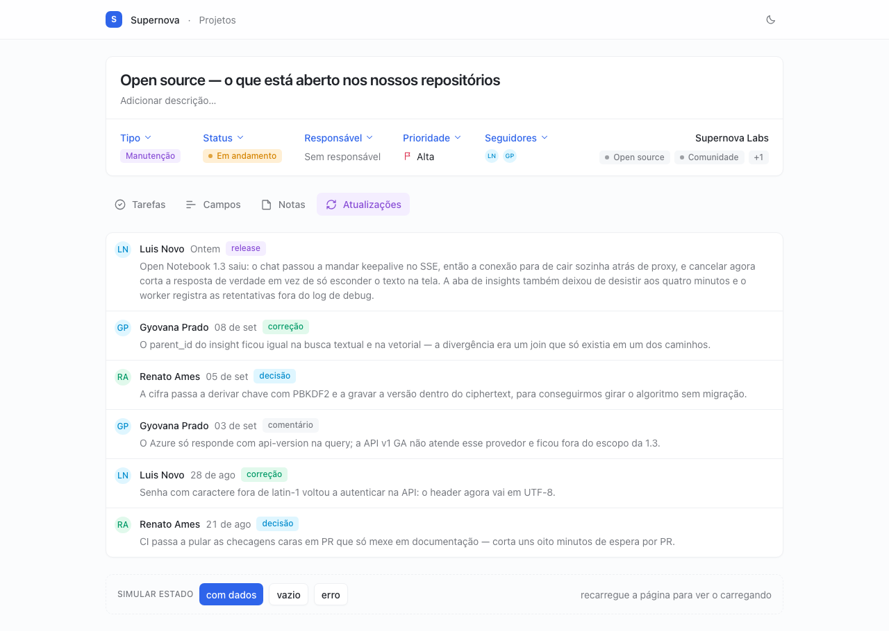
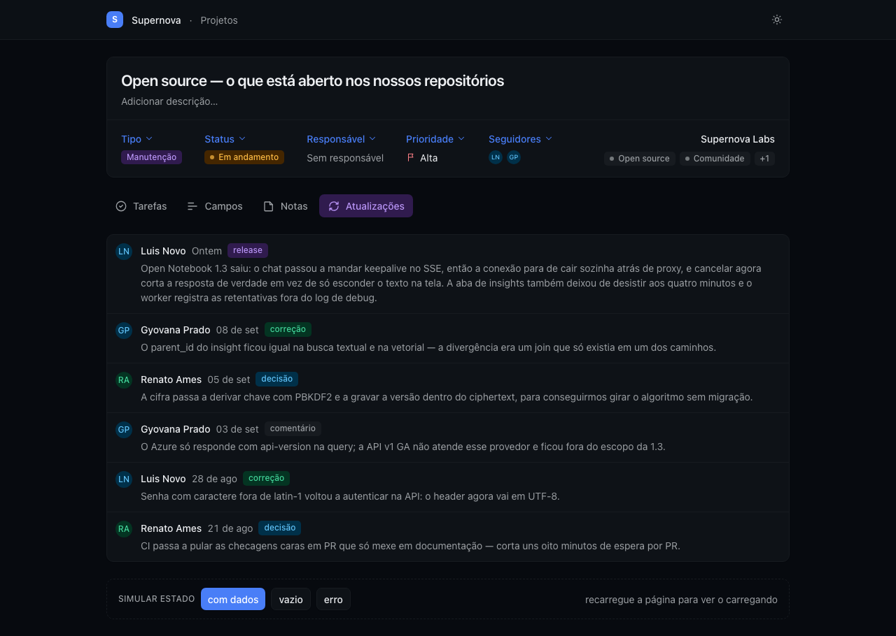
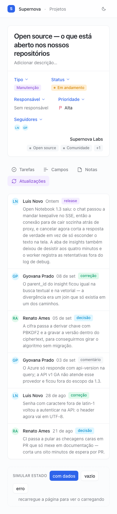
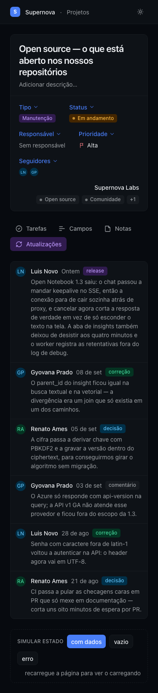

# O loop de verificação — rodado em 10/09/2026

A camada 5 diz que o agente olha o próprio trabalho antes de dizer "pronto": lint, story
com axe, e screenshot em 1280px (desktop) e 375px (celular) comparado com o exemplo. Até aqui, a parte do
screenshot seguia a documentação das ferramentas, não a nossa experiência. Este é o relato
de rodar o loop de ponta a ponta, com o Playwright MCP registrado em `.mcp.json` e a
instrução no `AGENTS.md`.

## O pedido

Sessão nova do agente, com o `AGENTS.md` no lugar e `bun dev` rodando:

> cria a aba de atualizações, lista com data, autor e resumo

Nenhuma menção a screenshot, tema, tamanho de tela ou verificação.

## O que ele fez sem ser pedido

| Passo do `AGENTS.md` | Fez? |
| --- | --- |
| Leu a skill e a tela de referência antes de escrever | sim — abriu `page-tasks` e `TasksPage.tsx` |
| Reusou o que existia | sim — `Avatar`, `Badge`, `EmptyState`, `ErrorState`, o contrato de `fetchTasks` |
| Os quatro estados | sim — skeleton, lista, vazio, erro com "Tentar de novo" |
| Só tokens semânticos, nenhum `dark:` | sim |
| Story para o componente novo | sim — lista e carregando |
| `bun lint` · `bun run build` · `bun run test:ui` | sim — 27 stories, axe incluído |
| **Screenshot em desktop e celular** | **sim — nos dois temas, sem ser lembrado** |
| Comparou com o exemplo da skill | olhou o print e descreveu o layout; a referência ficou implícita |

O resultado, em desktop e celular, tema claro e escuro:

| Desktop, claro | Desktop, escuro |
| --- | --- |
|  |  |

| Celular, claro | Celular, escuro |
| --- | --- |
|  |  |

## A segunda rodada: o texto longo

O bug do [experimento com e sem contexto](../agents-md/) só aparece com um título de
verdade. Então, na mesma sessão:

> Coloca um resumo de uns 300 caracteres na primeira atualização e confere de novo.

Ele trocou o dado, rodou lint, build e as stories de novo, **regerou os quatro screenshots
sem ser pedido** e descreveu o que viu: três linhas no desktop, nove no celular, a linha cresce
em altura, nada empurra o badge, nada vaza. Os prints acima já são os dessa rodada.

Bateu com o que está na tela.

## O que isso muda no padrão

**O loop funciona.** Com o Playwright MCP e a instrução de seis passos no `AGENTS.md`,
o agente fecha o ciclo sozinho, inclusive na segunda iteração. A ressalva do playbook
sobre a camada 5 cai: só a regressão visual segue sem ser exercitada.

Um ajuste saiu daqui: o passo 5 do `AGENTS.md` agora pede que o agente diga o que bateu
e o que não bateu com a referência, não só o que viu.

## O código gerado

Ficou no projeto, porque segue o padrão: `src/components/update-list.tsx`, a story ao
lado, `fetchUpdates` e `formatUpdateDate` em `src/data.ts`, e a aba ligada em
`src/pages/TasksPage.tsx`. A única edição humana foi renomear os exports da story para
inglês, que é a convenção do repo.
